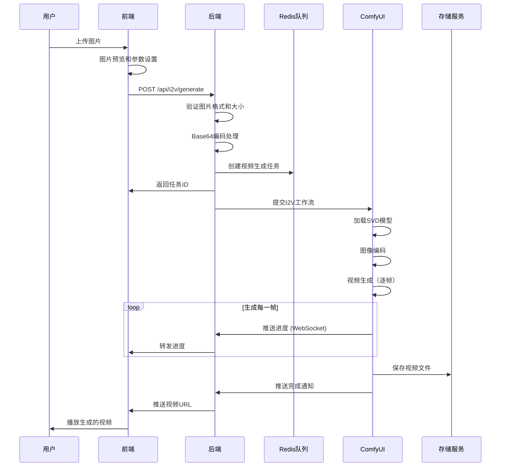

# 图生视频（Image-to-Video）技术详解

## 目录
1. [技术原理](#技术原理)
2. [核心算法](#核心算法)
3. [系统架构](#系统架构)
4. [实现细节](#实现细节)
5. [性能优化](#性能优化)
6. [实战案例](#实战案例)

## 技术原理

### 1.1 SVD（Stable Video Diffusion）模型架构

图生视频技术基于**Stable Video Diffusion**模型，这是Stability AI开发的视频生成模型，其核心架构包括：

#### 模型组件
```
输入图像 → 图像编码器 → 潜在空间表示 → 视频生成网络 → 时序解码器 → 输出视频
```

#### 技术特点
- **条件生成**：以静态图像作为条件输入
- **时序建模**：通过3D卷积和注意力机制建模时间维度
- **运动控制**：支持运动强度和方向控制
- **帧间一致性**：保证视频帧之间的连续性

### 1.2 运动建模机制

#### Motion Bucket ID 原理
```python
# 运动强度控制
motion_bucket_id = 127  # 范围：1-255
# 1-50: 微小运动（呼吸、眨眼）
# 51-127: 中等运动（头部转动、手势）
# 128-200: 较大运动（行走、跑步）
# 201-255: 剧烈运动（跳跃、快速移动）
```

#### 运动向量计算
```java
public class MotionVector {
    private float magnitude;  // 运动幅度
    private float direction;  // 运动方向
    private float temporal_consistency;  // 时间一致性
    
    public float[] calculateMotionField(int motionBucketId) {
        // 根据motion_bucket_id计算运动场
        float normalizedMotion = motionBucketId / 255.0f;
        
        // 应用非线性变换
        float motionScale = (float) Math.pow(normalizedMotion, 1.5);
        
        // 生成运动场矩阵
        return generateMotionField(motionScale);
    }
}
```

### 1.3 帧插值技术

#### 光流估计
```python
# 使用光流进行帧间插值
def optical_flow_interpolation(frame1, frame2, alpha=0.5):
    # 计算光流
    flow = cv2.calcOpticalFlowFarneback(
        frame1, frame2, 
        None, 0.5, 3, 15, 3, 5, 1.2, 0
    )
    
    # 双向插值
    interpolated = warp_flow(frame1, flow * alpha) * (1-alpha) + \
                   warp_flow(frame2, -flow * (1-alpha)) * alpha
    
    return interpolated
```

## 核心算法

### 2.1 图像到视频的扩散过程

#### 前向扩散（添加时序噪声）
```
I₀ (输入图像) → V₁ → V₂ → ... → Vₜ (噪声视频序列)

其中每一步：
V_{t+1} = √(1-βₜ) * Vₜ + √βₜ * ε
ε ~ N(0, I)  # 高斯噪声
βₜ: 噪声调度参数
```

#### 反向去噪（生成视频帧）
```
Vₜ → V_{t-1} → ... → V₁ → V₀ (生成的视频)

去噪过程：
V_{t-1} = 1/√αₜ * (Vₜ - βₜ/√(1-ᾱₜ) * ε_θ(Vₜ, t, I₀))

其中：
- ε_θ: 训练的噪声预测网络
- I₀: 条件输入图像
- αₜ = 1 - βₜ
- ᾱₜ = ∏ αᵢ
```

### 2.2 时序一致性算法

#### 帧间注意力机制
```java
public class TemporalAttention {
    
    // 计算帧间注意力权重
    public float[][] computeAttentionWeights(List<Frame> frames) {
        int numFrames = frames.size();
        float[][] weights = new float[numFrames][numFrames];
        
        for (int i = 0; i < numFrames; i++) {
            for (int j = 0; j < numFrames; j++) {
                // 计算帧i和帧j之间的相似度
                float similarity = cosineSimilarity(
                    frames.get(i).getFeatures(),
                    frames.get(j).getFeatures()
                );
                
                // 时间衰减因子
                float temporalDecay = (float) Math.exp(-Math.abs(i - j) * 0.1);
                
                weights[i][j] = similarity * temporalDecay;
            }
        }
        
        // 归一化
        return softmax(weights);
    }
}
```

#### 运动平滑算法
```java
public class MotionSmoothing {
    
    // 使用卡尔曼滤波平滑运动轨迹
    public List<MotionVector> smoothMotion(List<MotionVector> rawMotion) {
        KalmanFilter filter = new KalmanFilter(4, 2);
        List<MotionVector> smoothed = new ArrayList<>();
        
        for (MotionVector motion : rawMotion) {
            // 预测
            Matrix prediction = filter.predict();
            
            // 更新
            Matrix measurement = new Matrix(new double[][] {
                {motion.x}, {motion.y}
            });
            filter.update(measurement);
            
            // 获取平滑后的值
            Matrix state = filter.getState();
            smoothed.add(new MotionVector(
                state.get(0, 0),
                state.get(1, 0)
            ));
        }
        
        return smoothed;
    }
}
```

## 系统架构

### 3.1 完整架构图

```
┌─────────────────────────────────────────────────────────┐
│                      前端界面                             │
│  ┌────────────┐  ┌────────────┐  ┌─────────────┐       │
│  │ 图片上传   │  │ 参数配置   │  │ 视频预览    │       │
│  └─────┬──────┘  └─────┬──────┘  └──────▲──────┘       │
│        │               │                 │              │
└────────┼───────────────┼─────────────────┼──────────────┘
         │               │                 │
         ▼               ▼                 │
┌─────────────────────────────────────────────────────────┐
│                   Image2VideoService                     │
│  ┌──────────────────────────────────────────────┐      │
│  │ 1. 图片预处理                                 │      │
│  │    - 格式转换 (JPEG/PNG → Tensor)            │      │
│  │    - 尺寸调整 (Resize to 512/768)            │      │
│  │    - 归一化 (Normalize to [-1, 1])           │      │
│  └──────────────────────────────────────────────┘      │
│  ┌──────────────────────────────────────────────┐      │
│  │ 2. 参数配置                                   │      │
│  │    - Motion Bucket ID (运动强度)              │      │
│  │    - FPS (帧率设置)                          │      │
│  │    - Duration (视频时长)                      │      │
│  │    - Augmentation Level (增强等级)            │      │
│  └──────────────────────────────────────────────┘      │
│  ┌──────────────────────────────────────────────┐      │
│  │ 3. 工作流构建                                 │      │
│  │    - 加载SVD模型                              │      │
│  │    - 配置采样器                               │      │
│  │    - 设置视频参数                             │      │
│  └──────────────────────────────────────────────┘      │
└────────────────────┬────────────────────────────────────┘
                     │
                     ▼
┌─────────────────────────────────────────────────────────┐
│                    ComfyUI Engine                        │
│  ┌──────────────────────────────────────────────┐      │
│  │          SVD Video Generation Pipeline         │      │
│  ├──────────────────────────────────────────────┤      │
│  │ 1. Image Encoder                              │      │
│  │    输入: 512×512 RGB图像                      │      │
│  │    输出: 64×64×4 潜在表示                     │      │
│  ├──────────────────────────────────────────────┤      │
│  │ 2. Video Latent Generation                    │      │
│  │    输入: 图像潜在 + 运动参数                  │      │
│  │    处理: 3D U-Net + Temporal Attention        │      │
│  │    输出: T×64×64×4 视频潜在序列               │      │
│  ├──────────────────────────────────────────────┤      │
│  │ 3. Video Decoder                              │      │
│  │    输入: 视频潜在序列                         │      │
│  │    输出: T×H×W×3 RGB视频帧                    │      │
│  └──────────────────────────────────────────────┘      │
└─────────────────────────────────────────────────────────┘
```

### 3.2 数据流程图



## 实现细节

### 4.1 后端服务实现

#### Image2VideoServiceImpl 核心代码

```java
@Service
@Slf4j
public class Image2VideoServiceImpl implements Image2VideoService {

    @Autowired
    private FreemarkerService freemarkerService;
    @Autowired
    private RedisService redisService;
    @Autowired
    private UserFundRecordService userFundRecordService;
    @Autowired
    private ImageProcessingService imageProcessingService;

    @Override
    public VideoGenerationResponseDto imageToVideo(Image2VideoReqDto reqDto) 
            throws Exception {
        
        // 1. 参数验证
        validateRequest(reqDto);
        
        // 2. 图片预处理
        ProcessedImage processedImage = preprocessImage(reqDto);
        
        // 3. 构建视频生成任务
        VideoGenerationTask task = buildVideoTask(reqDto, processedImage);
        
        // 4. 计算所需积分
        int requiredPoints = calculateRequiredPoints(
            reqDto.getDuration(), 
            reqDto.getFps()
        );
        
        // 5. 检查用户余额
        Long userId = UserUtils.getUserId();
        checkUserBalance(userId, requiredPoints);
        
        // 6. 提交任务到队列
        long queueIndex = submitTask(task);
        
        // 7. 扣除积分
        deductUserPoints(userId, requiredPoints);
        
        // 8. 返回响应
        return buildResponse(task.getId(), queueIndex);
    }
    
    private ProcessedImage preprocessImage(Image2VideoReqDto reqDto) {
        String imageBase64 = reqDto.getImageBase64();
        
        // Base64解码
        byte[] imageBytes = Base64.getDecoder().decode(imageBase64);
        
        // 图像处理
        BufferedImage image = ImageIO.read(
            new ByteArrayInputStream(imageBytes)
        );
        
        // 调整尺寸（SVD模型要求特定尺寸）
        BufferedImage resized = resizeImage(image, 512, 512);
        
        // 归一化处理
        float[][][] normalized = normalizeImage(resized);
        
        return new ProcessedImage(resized, normalized);
    }
    
    private VideoGenerationTask buildVideoTask(
            Image2VideoReqDto reqDto, 
            ProcessedImage processedImage) {
        
        // 构建ComfyUI工作流参数
        Map<String, Object> params = new HashMap<>();
        
        // 基础参数
        params.put("image_base64", encodeToBase64(processedImage));
        params.put("motion_bucket_id", reqDto.getMotionBucketId());
        params.put("fps", reqDto.getFps());
        params.put("duration_seconds", reqDto.getDuration());
        params.put("augmentation_level", reqDto.getAugmentationLevel());
        
        // 高级参数
        params.put("cfg_scale", reqDto.getCfgScale());
        params.put("steps", reqDto.getSteps());
        params.put("seed", reqDto.getSeed());
        params.put("model_name", reqDto.getModelName());
        
        // 运动控制参数
        if (reqDto.getPropmt() != null) {
            params.put("motion_prompt", reqDto.getPropmt());
        }
        
        // 生成工作流JSON
        String workflow = freemarkerService.renderImage2Video(params);
        
        // 创建任务对象
        VideoGenerationTask task = new VideoGenerationTask();
        task.setUserId(UserUtils.getUserId());
        task.setWorkflow(workflow);
        task.setParams(params);
        task.setType("image2video");
        task.setStatus("pending");
        task.setCreatedAt(new Date());
        
        return task;
    }
    
    private int calculateRequiredPoints(int duration, int fps) {
        // 基础费用：8积分
        int baseCost = 8;
        
        // 时长费用：每秒4积分
        int durationCost = duration * 4;
        
        // 帧率附加费用
        int fpsCost = 0;
        if (fps > 8) {
            fpsCost = (fps - 8) / 4;  // 每增加4帧多1积分
        }
        
        return baseCost + durationCost + fpsCost;
    }
}
```

### 4.2 ComfyUI工作流配置

#### i2v.ftlh 模板实现

```json
{
  "1": {
    "class_type": "ImageOnlyCheckpointLoader",
    "inputs": {
      "ckpt_name": "${config.model_name}"
    }
  },
  
  "2": {
    "class_type": "SVDImageEncode",
    "inputs": {
      "vae": ["1", 2],
      "image": "${config.image_base64}",
      "width": 512,
      "height": 512,
      "frames": ${config.duration_seconds * config.fps},
      "motion_bucket_id": ${config.motion_bucket_id},
      "augmentation_level": ${config.augmentation_level}
    }
  },
  
  "3": {
    "class_type": "VideoLinearCFGGuidance",
    "inputs": {
      "model": ["1", 0],
      "min_cfg": 1.0,
      "max_cfg": ${config.cfg_scale}
    }
  },
  
  "4": {
    "class_type": "KSamplerAdvanced",
    "inputs": {
      "model": ["3", 0],
      "seed": ${config.seed},
      "steps": ${config.steps},
      "cfg": ${config.cfg_scale},
      "sampler_name": "euler",
      "scheduler": "karras",
      "positive": ["2", 0],
      "negative": ["2", 1],
      "latent_image": ["2", 2],
      "start_at_step": 0,
      "end_at_step": ${config.steps},
      "return_with_leftover_noise": "disable"
    }
  },
  
  "5": {
    "class_type": "VAEDecodeTiled",
    "inputs": {
      "samples": ["4", 0],
      "vae": ["1", 2],
      "tile_size": 512
    }
  },
  
  "6": {
    "class_type": "VideoFrameInterpolation",
    "inputs": {
      "frames": ["5", 0],
      "interpolation_factor": 2,
      "method": "RIFE"
    }
  },
  
  "7": {
    "class_type": "VideoCombine",
    "inputs": {
      "images": ["6", 0],
      "frame_rate": ${config.fps},
      "loop_count": 0,
      "filename_prefix": "I2V",
      "format": "video/h264-mp4",
      "save_image": true
    }
  }
}
```

### 4.3 前端实现

#### Vue组件详细实现

```vue
<template>
  <div class="i2v-container">
    <!-- 图片上传区域 -->
    <div class="upload-section">
      <el-upload
        ref="uploadRef"
        class="image-uploader"
        :on-change="handleImageUpload"
        :before-upload="beforeImageUpload"
        :show-file-list="false"
        accept="image/jpeg,image/png,image/webp"
        drag
      >
        <div v-if="!imagePreview" class="upload-placeholder">
          <i class="el-icon-upload"></i>
          <div class="upload-text">
            将图片拖到此处，或<em>点击上传</em>
          </div>
          <div class="upload-hint">
            支持 JPG/PNG/WebP 格式，建议尺寸 512×512 以上
          </div>
        </div>
        <div v-else class="image-preview">
          
          <div class="preview-actions">
            <el-button 
              type="danger" 
              size="small" 
              @click.stop="removeImage"
            >
              移除图片
            </el-button>
          </div>
        </div>
      </el-upload>
    </div>

    <!-- 参数配置区域 -->
    <div class="config-section">
      <h3>视频生成参数</h3>
      
      <!-- 基础参数 -->
      <div class="config-group">
        <h4>基础设置</h4>
        
        <div class="config-item">
          <label>视频时长</label>
          <el-radio-group v-model="config.duration">
            <el-radio-button :label="2">2秒</el-radio-button>
            <el-radio-button :label="4">4秒</el-radio-button>
            <el-radio-button :label="6">6秒</el-radio-button>
            <el-radio-button :label="8">8秒</el-radio-button>
          </el-radio-group>
        </div>
        
        <div class="config-item">
          <label>帧率 (FPS)</label>
          <el-select v-model="config.fps">
            <el-option :label="4" :value="4">4 FPS (草稿)</el-option>
            <el-option :label="8" :value="8">8 FPS (流畅)</el-option>
            <el-option :label="12" :value="12">12 FPS (标准)</el-option>
            <el-option :label="16" :value="16">16 FPS (高质量)</el-option>
            <el-option :label="24" :value="24">24 FPS (电影级)</el-option>
          </el-select>
        </div>
      </div>
      
      <!-- 运动控制 -->
      <div class="config-group">
        <h4>运动控制</h4>
        
        <div class="config-item">
          <label>
            运动强度
            <el-tooltip content="控制视频中的运动幅度">
              <i class="el-icon-question"></i>
            </el-tooltip>
          </label>
          <div class="slider-container">
            <el-slider
              v-model="config.motionBucketId"
              :min="1"
              :max="255"
              :marks="motionMarks"
              show-input
            />
          </div>
        </div>
        
        <div class="config-item">
          <label>运动描述（可选）</label>
          <el-input
            v-model="config.motionPrompt"
            type="textarea"
            :rows="2"
            placeholder="描述期望的运动效果，如：缓慢放大、向左平移、旋转等"
          />
        </div>
        
        <div class="config-item">
          <label>
            增强等级
            <el-tooltip content="控制运动的随机性和多样性">
              <i class="el-icon-question"></i>
            </el-tooltip>
          </label>
          <el-slider
            v-model="config.augmentationLevel"
            :min="0"
            :max="1"
            :step="0.1"
            :format-tooltip="val => `${val * 100}%`"
          />
        </div>
      </div>
      
      <!-- 高级参数 -->
      <el-collapse v-model="activeCollapse">
        <el-collapse-item title="高级参数" name="advanced">
          <div class="config-item">
            <label>生成步数</label>
            <el-input-number
              v-model="config.steps"
              :min="10"
              :max="50"
              :step="5"
            />
          </div>
          
          <div class="config-item">
            <label>CFG Scale</label>
            <el-slider
              v-model="config.cfgScale"
              :min="1"
              :max="5"
              :step="0.5"
              show-input
            />
          </div>
          
          <div class="config-item">
            <label>随机种子</label>
            <el-input-number
              v-model="config.seed"
              :min="-1"
              :max="2147483647"
            />
            <el-button 
              size="small" 
              @click="config.seed = -1"
            >
              随机
            </el-button>
          </div>
        </el-collapse-item>
      </el-collapse>
    </div>

    <!-- 生成按钮 -->
    <div class="action-section">
      <el-button
        type="primary"
        size="large"
        :disabled="!imageBase64 || isGenerating"
        @click="generateVideo"
      >
        <i class="el-icon-video-play"></i>
        生成视频（消耗 {{ estimatedCost }} 积分）
      </el-button>
    </div>

    <!-- 结果展示区域 -->
    <div class="result-section" v-if="generatedVideos.length > 0">
      <h3>生成结果</h3>
      <div class="video-grid">
        <div 
          v-for="video in generatedVideos" 
          :key="video.id"
          class="video-card"
        >
          <video
            :src="video.url"
            controls
            loop
            :poster="video.thumbnail"
            @click="openVideoPlayer(video)"
          />
          <div class="video-info">
            <span class="video-duration">{{ video.duration }}秒</span>
            <span class="video-fps">{{ video.fps }} FPS</span>
            <span class="video-size">{{ formatFileSize(video.size) }}</span>
          </div>
          <div class="video-actions">
            <el-button 
              type="text" 
              @click="downloadVideo(video)"
            >
              下载
            </el-button>
            <el-button 
              type="text" 
              @click="shareVideo(video)"
            >
              分享
            </el-button>
            <el-button 
              type="text" 
              @click="deleteVideo(video)"
            >
              删除
            </el-button>
          </div>
        </div>
      </div>
    </div>

    <!-- 视频播放器弹窗 -->
    <el-dialog
      v-model="playerVisible"
      title="视频预览"
      width="80%"
      :before-close="closePlayer"
    >
      <video
        v-if="currentVideo"
        :src="currentVideo.url"
        controls
        autoplay
        style="width: 100%;"
      />
    </el-dialog>

    <!-- 进度显示 -->
    <loading-overlay
      v-if="isGenerating"
      :progress="generationProgress"
      :status="generationStatus"
      @cancel="cancelGeneration"
    />
  </div>
</template>

<script setup lang="ts">
import { ref, computed, onMounted, watch } from 'vue';
import { ElMessage } from 'element-plus';
import { Client } from '@stomp/stompjs';
import Image2VideoAPI from '@/api/i2v';
import LoadingOverlay from '@/components/LoadingOverlay.vue';

// 响应式数据
const imageBase64 = ref<string>('');
const imagePreview = ref<string>('');
const isGenerating = ref(false);
const generationProgress = ref(0);
const generationStatus = ref('');
const generatedVideos = ref<any[]>([]);
const playerVisible = ref(false);
const currentVideo = ref<any>(null);
const activeCollapse = ref<string[]>([]);

// 配置参数
const config = ref({
  duration: 4,
  fps: 8,
  motionBucketId: 127,
  motionPrompt: '',
  augmentationLevel: 0.0,
  steps: 25,
  cfgScale: 2.5,
  seed: -1,
  model: 'svd',
  videoLoop: false
});

// 运动强度标记
const motionMarks = {
  1: '静态',
  50: '微动',
  127: '中等',
  200: '活跃',
  255: '剧烈'
};

// WebSocket客户端
let stompClient: Client | null = null;
const clientId = `i2v_${Date.now()}_${Math.random().toString(36).substr(2, 9)}`;

// 计算预估积分消耗
const estimatedCost = computed(() => {
  const baseCost = 8;
  const durationCost = config.value.duration * 4;
  const fpsCost = config.value.fps > 8 ? Math.floor((config.value.fps - 8) / 4) : 0;
  return baseCost + durationCost + fpsCost;
});

// 图片上传处理
function handleImageUpload(file: any) {
  const reader = new FileReader();
  reader.onload = (e: any) => {
    imagePreview.value = e.target.result;
    imageBase64.value = e.target.result.split(',')[1];
    
    // 分析图片特征，自动推荐参数
    analyzeImageAndSuggestParams();
  };
  reader.readAsDataURL(file.raw);
}

// 图片分析和参数推荐
async function analyzeImageAndSuggestParams() {
  try {
    // 创建图片对象
    const img = new Image();
    img.src = imagePreview.value;
    await new Promise(resolve => img.onload = resolve);
    
    // 分析图片内容（这里可以集成AI分析）
    const canvas = document.createElement('canvas');
    const ctx = canvas.getContext('2d');
    canvas.width = img.width;
    canvas.height = img.height;
    ctx?.drawImage(img, 0, 0);
    
    // 获取图片数据进行简单分析
    const imageData = ctx?.getImageData(0, 0, canvas.width, canvas.height);
    if (imageData) {
      const analysis = analyzeImageContent(imageData);
      
      // 根据分析结果推荐参数
      if (analysis.hasMotion) {
        config.value.motionBucketId = 150;
        ElMessage.info('检测到动态元素，已自动调整运动强度');
      }
      if (analysis.isPortrait) {
        config.value.motionBucketId = 80;
        config.value.augmentationLevel = 0.2;
        ElMessage.info('检测到人像，已优化参数设置');
      }
    }
  } catch (error) {
    console.error('图片分析失败:', error);
  }
}

// 图片内容分析
function analyzeImageContent(imageData: ImageData) {
  // 这里是简化的分析逻辑，实际可以使用更复杂的算法
  const pixels = imageData.data;
  let motionIndicator = 0;
  let faceIndicator = 0;
  
  // 分析像素特征
  for (let i = 0; i < pixels.length; i += 4) {
    const r = pixels[i];
    const g = pixels[i + 1];
    const b = pixels[i + 2];
    
    // 检测边缘（简化版）
    if (i > 0 && Math.abs(r - pixels[i - 4]) > 30) {
      motionIndicator++;
    }
    
    // 检测肤色（简化版）
    if (r > 95 && g > 40 && b > 20 && 
        r > g && r > b && Math.abs(r - g) > 15) {
      faceIndicator++;
    }
  }
  
  return {
    hasMotion: motionIndicator > pixels.length * 0.1,
    isPortrait: faceIndicator > pixels.length * 0.05
  };
}

// 生成视频
async function generateVideo() {
  if (!imageBase64.value) {
    ElMessage.warning('请先上传图片');
    return;
  }
  
  isGenerating.value = true;
  generationProgress.value = 0;
  generationStatus.value = '准备生成...';
  
  try {
    const response = await Image2VideoAPI.generate({
      imageBase64: imageBase64.value,
      ...config.value,
      clientId
    });
    
    if (response.code === '200') {
      generationStatus.value = '任务已提交，等待处理...';
      // WebSocket会处理后续进度
    } else {
      throw new Error(response.msg || '生成失败');
    }
  } catch (error: any) {
    ElMessage.error(error.message || '生成失败');
    isGenerating.value = false;
  }
}

// WebSocket消息处理
function handleWebSocketMessage(message: any) {
  const data = JSON.parse(message.body);
  
  switch (data.type) {
    case 'progress':
      generationProgress.value = (data.value / data.max) * 100;
      generationStatus.value = `生成中... ${Math.round(generationProgress.value)}%`;
      break;
      
    case 'preview':
      // 显示预览帧
      if (data.frame) {
        updatePreviewFrame(data.frame);
      }
      break;
      
    case 'videoResult':
      // 视频生成完成
      const video = {
        id: Date.now(),
        url: data.url,
        thumbnail: data.thumbnail,
        duration: config.value.duration,
        fps: config.value.fps,
        size: data.size,
        createdAt: new Date()
      };
      generatedVideos.value.unshift(video);
      isGenerating.value = false;
      ElMessage.success('视频生成完成！');
      break;
      
    case 'error':
      ElMessage.error(data.message || '生成失败');
      isGenerating.value = false;
      break;
  }
}

// 初始化WebSocket连接
onMounted(() => {
  stompClient = new Client({
    brokerURL: import.meta.env.VITE_WS_HOST_URL,
    connectHeaders: { clientId },
    reconnectDelay: 5000,
    heartbeatIncoming: 4000,
    heartbeatOutgoing: 4000,
    
    onConnect: () => {
      console.log('WebSocket connected');
      
      // 订阅消息
      stompClient?.subscribe('/topic/messages', handleWebSocketMessage);
      stompClient?.subscribe(`/user/${clientId}/topic/messages`, handleWebSocketMessage);
    },
    
    onStompError: (frame) => {
      console.error('STOMP error:', frame);
    }
  });
  
  stompClient.activate();
});

// 组件卸载时清理
onUnmounted(() => {
  if (stompClient) {
    stompClient.deactivate();
  }
});
</script>

<style scoped lang="scss">
.i2v-container {
  max-width: 1200px;
  margin: 0 auto;
  padding: 20px;
  
  .upload-section {
    margin-bottom: 30px;
    
    .image-uploader {
      width: 100%;
      
      .upload-placeholder {
        height: 400px;
        display: flex;
        flex-direction: column;
        justify-content: center;
        align-items: center;
        border: 2px dashed #d9d9d9;
        border-radius: 6px;
        cursor: pointer;
        transition: border-color 0.3s;
        
        &:hover {
          border-color: #409eff;
        }
        
        .upload-text {
          margin: 14px 0;
          
          em {
            color: #409eff;
          }
        }
        
        .upload-hint {
          color: #909399;
          font-size: 12px;
        }
      }
      
      .image-preview {
        position: relative;
        
        img {
          width: 100%;
          max-height: 500px;
          object-fit: contain;
        }
        
        .preview-actions {
          position: absolute;
          top: 10px;
          right: 10px;
        }
      }
    }
  }
  
  .config-section {
    background: #f5f7fa;
    padding: 20px;
    border-radius: 8px;
    margin-bottom: 20px;
    
    h3 {
      margin-bottom: 20px;
      color: #303133;
    }
    
    .config-group {
      margin-bottom: 25px;
      
      h4 {
        margin-bottom: 15px;
        color: #606266;
        font-size: 14px;
      }
    }
    
    .config-item {
      display: flex;
      align-items: center;
      margin-bottom: 15px;
      
      label {
        width: 120px;
        color: #606266;
        font-size: 14px;
        
        i {
          margin-left: 5px;
          color: #909399;
          cursor: help;
        }
      }
      
      .slider-container {
        flex: 1;
        padding: 0 20px;
      }
    }
  }
  
  .video-grid {
    display: grid;
    grid-template-columns: repeat(auto-fill, minmax(300px, 1fr));
    gap: 20px;
    
    .video-card {
      background: white;
      border-radius: 8px;
      overflow: hidden;
      box-shadow: 0 2px 12px rgba(0, 0, 0, 0.1);
      
      video {
        width: 100%;
        height: 200px;
        object-fit: cover;
        cursor: pointer;
      }
      
      .video-info {
        padding: 10px;
        display: flex;
        justify-content: space-between;
        font-size: 12px;
        color: #909399;
      }
      
      .video-actions {
        padding: 0 10px 10px;
        display: flex;
        justify-content: space-around;
      }
    }
  }
}
</style>
```

## 性能优化

### 5.1 GPU加速优化

```python
# CUDA优化配置
import torch
import torch.nn as nn
from torch.cuda.amp import autocast, GradScaler

class OptimizedSVDModel:
    def __init__(self):
        # 启用混合精度训练
        self.scaler = GradScaler()
        
        # 启用cudnn优化
        torch.backends.cudnn.benchmark = True
        torch.backends.cudnn.deterministic = False
        
        # 设置内存分配策略
        torch.cuda.set_per_process_memory_fraction(0.8)
        
    @autocast()
    def generate_video(self, image, params):
        # 使用半精度计算
        with torch.cuda.amp.autocast():
            # 图像编码
            latent = self.encode_image(image.half())
            
            # 视频生成
            video_latent = self.generate_latent_video(
                latent, 
                params['motion_bucket_id'],
                params['fps']
            )
            
            # 解码
            frames = self.decode_video(video_latent)
            
        return frames
```

### 5.2 内存优化

```java
@Component
public class VideoMemoryManager {
    
    private static final int MAX_CACHE_SIZE = 100 * 1024 * 1024; // 100MB
    private final Map<String, SoftReference<byte[]>> frameCache = new ConcurrentHashMap<>();
    
    // 分块处理大视频
    public void processLargeVideo(String videoPath, int chunkSize) {
        try (RandomAccessFile file = new RandomAccessFile(videoPath, "r")) {
            long fileSize = file.length();
            byte[] buffer = new byte[chunkSize];
            
            for (long pos = 0; pos < fileSize; pos += chunkSize) {
                file.seek(pos);
                int bytesRead = file.read(buffer);
                
                // 处理块
                processChunk(buffer, bytesRead);
                
                // 清理缓存
                if (pos % (chunkSize * 10) == 0) {
                    cleanupCache();
                }
            }
        } catch (IOException e) {
            log.error("视频处理失败", e);
        }
    }
    
    // 智能缓存管理
    private void cleanupCache() {
        long currentSize = calculateCacheSize();
        if (currentSize > MAX_CACHE_SIZE) {
            // 清理最旧的缓存
            frameCache.entrySet().stream()
                .sorted(Map.Entry.comparingByKey())
                .limit(frameCache.size() / 2)
                .forEach(entry -> frameCache.remove(entry.getKey()));
        }
    }
}
```

### 5.3 并行处理

```java
@Service
public class ParallelVideoProcessor {
    
    private final ExecutorService executorService = Executors.newFixedThreadPool(4);
    private final ForkJoinPool forkJoinPool = new ForkJoinPool(8);
    
    // 并行处理多个视频帧
    public CompletableFuture<List<ProcessedFrame>> processFramesParallel(
            List<RawFrame> frames) {
        
        List<CompletableFuture<ProcessedFrame>> futures = frames.stream()
            .map(frame -> CompletableFuture.supplyAsync(
                () -> processFrame(frame), 
                executorService
            ))
            .collect(Collectors.toList());
        
        return CompletableFuture.allOf(
            futures.toArray(new CompletableFuture[0])
        ).thenApply(v -> futures.stream()
            .map(CompletableFuture::join)
            .collect(Collectors.toList())
        );
    }
    
    // 使用Fork/Join框架处理大任务
    public List<Frame> processVideoWithForkJoin(Video video) {
        return forkJoinPool.invoke(new VideoProcessTask(video, 0, video.getFrameCount()));
    }
    
    class VideoProcessTask extends RecursiveTask<List<Frame>> {
        private static final int THRESHOLD = 10;
        private final Video video;
        private final int start;
        private final int end;
        
        VideoProcessTask(Video video, int start, int end) {
            this.video = video;
            this.start = start;
            this.end = end;
        }
        
        @Override
        protected List<Frame> compute() {
            if (end - start <= THRESHOLD) {
                // 直接处理
                return processFrameRange(video, start, end);
            } else {
                // 分治处理
                int mid = (start + end) / 2;
                VideoProcessTask left = new VideoProcessTask(video, start, mid);
                VideoProcessTask right = new VideoProcessTask(video, mid, end);
                
                left.fork();
                List<Frame> rightResult = right.compute();
                List<Frame> leftResult = left.join();
                
                List<Frame> result = new ArrayList<>();
                result.addAll(leftResult);
                result.addAll(rightResult);
                return result;
            }
        }
    }
}
```

## 实战案例

### 6.1 人像视频生成

```java
// 专门优化的人像视频生成
public class PortraitVideoGenerator {
    
    public VideoResult generatePortraitVideo(BufferedImage portrait) {
        // 1. 人脸检测和对齐
        Face face = detectAndAlignFace(portrait);
        
        // 2. 优化参数设置
        VideoParams params = new VideoParams();
        params.setMotionBucketId(60);  // 较小的运动幅度
        params.setAugmentationLevel(0.1f);  // 低增强，保持稳定
        params.setCfgScale(2.0f);  // 低CFG，更自然
        
        // 3. 添加眨眼和微笑动作
        params.setMotionPrompt("subtle facial expressions, blinking, slight smile");
        
        // 4. 生成视频
        return generateVideo(portrait, params);
    }
}
```

### 6.2 风景视频生成

```java
// 风景视频生成优化
public class LandscapeVideoGenerator {
    
    public VideoResult generateLandscapeVideo(BufferedImage landscape) {
        // 1. 场景分析
        SceneAnalysis scene = analyzeScene(landscape);
        
        // 2. 根据场景类型设置参数
        VideoParams params = new VideoParams();
        
        if (scene.hasWater()) {
            params.setMotionBucketId(100);
            params.setMotionPrompt("gentle water flow, ripples");
        } else if (scene.hasClouds()) {
            params.setMotionBucketId(80);
            params.setMotionPrompt("slowly moving clouds");
        } else if (scene.hasTrees()) {
            params.setMotionBucketId(70);
            params.setMotionPrompt("swaying trees, rustling leaves");
        }
        
        // 3. 设置较长的时长和较高的帧率
        params.setDuration(6);
        params.setFps(12);
        
        return generateVideo(landscape, params);
    }
}
```

### 6.3 产品展示视频

```java
// 产品360度展示视频
public class ProductShowcaseGenerator {
    
    public VideoResult generate360Video(BufferedImage product) {
        // 1. 背景移除
        BufferedImage isolated = removeBackground(product);
        
        // 2. 设置旋转参数
        VideoParams params = new VideoParams();
        params.setMotionBucketId(150);
        params.setMotionPrompt("360 degree rotation, smooth turntable");
        params.setDuration(8);
        params.setFps(24);
        params.setVideoLoop(true);  // 循环播放
        
        // 3. 添加光照效果
        params.setAugmentationLevel(0.3f);
        
        return generateVideo(isolated, params);
    }
}
```

## 总结

图生视频技术通过深度学习模型实现了从静态图像到动态视频的转换，主要技术要点包括：

1. **模型架构**：基于SVD的扩散模型，支持时序建模
2. **运动控制**：通过Motion Bucket ID等参数精确控制运动强度
3. **质量优化**：帧插值、运动平滑等技术提升视频质量
4. **性能优化**：GPU加速、内存管理、并行处理等优化策略
5. **应用场景**：人像动画、风景视频、产品展示等多种应用

整个系统通过精心设计的架构和优化，实现了高质量的图生视频功能，为用户提供了强大的创意工具。