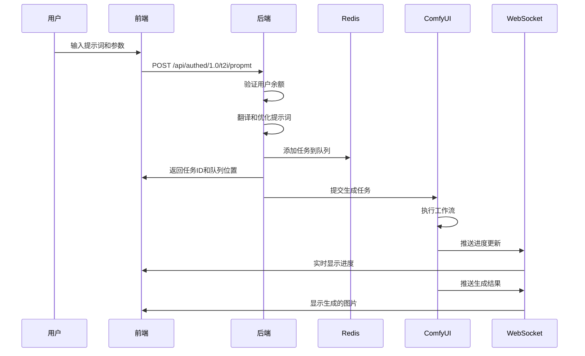

# 文生图（Text-to-Image）技术详解

## 目录
1. [技术原理](#技术原理)
2. [系统架构](#系统架构)
3. [核心组件](#核心组件)
4. [实现流程](#实现流程)
5. [关键技术点](#关键技术点)
6. [优化策略](#优化策略)

## 技术原理

### 1.1 扩散模型基础

文生图功能基于**Stable Diffusion**扩散模型实现，其核心原理包括：

#### 前向扩散过程（Forward Diffusion）
```
原始图像 → 逐步添加噪声 → 纯噪声
x₀ → x₁ → x₂ → ... → xₜ
```

#### 反向去噪过程（Reverse Denoising）
```
纯噪声 → 逐步去噪 → 生成图像
xₜ → xₜ₋₁ → xₜ₋₂ → ... → x₀
```

### 1.2 文本编码机制

#### CLIP文本编码器
- 将自然语言提示词转换为768维向量
- 支持多语言输入（通过Ollama翻译服务）
- 最大支持77个token的文本长度

#### 文本嵌入处理流程
```java
// 原始提示词
String userPrompt = "一只猫坐在窗台上";

// 翻译处理
String translatedPrompt = ollamaService.translate(userPrompt);
// 结果: "a cat sitting on the windowsill"

// 质量增强
String enhancedPrompt = "(8k, best quality, masterpiece),(high detailed skin)," + translatedPrompt;

// 负向提示词处理
String negativePrompt = "bad face,naked,bad finger,bad arm,bad leg,bad eye";
```

### 1.3 采样算法

系统支持多种采样器：

| 采样器 | 特点 | 适用场景 | 步数建议 |
|--------|------|----------|----------|
| Euler | 快速、稳定 | 通用场景 | 20-30 |
| DPM++ 2M | 高质量 | 细节要求高 | 25-35 |
| DPM++ SDE | 随机性强 | 艺术创作 | 25-40 |
| DPM++ 3M SDE | 最高质量 | 专业输出 | 30-50 |

## 系统架构

### 2.1 整体架构图

```
┌─────────────────────────────────────────────────┐
│                   前端界面                       │
│  ┌──────────┐  ┌──────────┐  ┌──────────┐      │
│  │提示词输入│  │参数配置  │  │结果展示  │      │
│  └────┬─────┘  └────┬─────┘  └────▲─────┘      │
│       │            │              │             │
└───────┼────────────┼──────────────┼─────────────┘
        │            │              │
        ▼            ▼              │
┌─────────────────────────────────────────────────┐
│               Spring Boot 后端                   │
│  ┌──────────────────────────────────────┐      │
│  │     Text2ImageController              │      │
│  └────────────┬─────────────────────────┘      │
│               ▼                                 │
│  ┌──────────────────────────────────────┐      │
│  │     Text2ImageService                 │      │
│  │  - 参数验证                           │      │
│  │  - 提示词翻译                         │      │
│  │  - 任务构建                           │      │
│  └────────────┬─────────────────────────┘      │
│               ▼                                 │
│  ┌──────────────────────────────────────┐      │
│  │     FreemarkerService                 │      │
│  │  - 工作流模板渲染                     │      │
│  └────────────┬─────────────────────────┘      │
└───────────────┼─────────────────────────────────┘
                │
                ▼
┌─────────────────────────────────────────────────┐
│              ComfyUI 引擎                        │
│  ┌──────────────────────────────────────┐      │
│  │     Workflow Execution                │      │
│  │  1. 模型加载 (Checkpoint Loader)      │      │
│  │  2. 提示词编码 (CLIP Encode)          │      │
│  │  3. 潜在空间采样 (KSampler)           │      │
│  │  4. 解码输出 (VAE Decode)             │      │
│  └──────────────────────────────────────┘      │
└─────────────────────────────────────────────────┘
```

### 2.2 数据流程



## 核心组件

### 3.1 后端服务实现

#### Text2ImageServiceImpl 核心逻辑

```java
@Service
public class Text2ImageServiceImpl implements Text2ImageService {
    
    @Override
    public Text2ImageResponeDto textToImage(Text2ImageReqDto reqDto) throws Exception {
        // 1. 用户余额检查
        Long userId = UserUtils.getUserId();
        int balance = userFundRecordService.checkBalance(userId);
        if(balance < 5){
            throw new CustomException("余额不足，请充值");
        }
        
        // 2. 构建ComfyUI任务
        ComfyuiTask task = buildComfyuiTask(reqDto);
        
        // 3. 任务入队
        long queueIndex = redisService.addTask(task);
        
        // 4. 扣除积分
        userFundRecordService.deductBalance(userId, 5);
        
        // 5. 返回响应
        return buildResponse(task.getId(), queueIndex);
    }
    
    private ComfyuiTask buildComfyuiTask(Text2ImageReqDto reqDto) {
        ComfyuiModel model = new ComfyuiModel();
        
        // 参数映射
        model.setModelName(reqDto.modelName());
        model.setScheduler(reqDto.scheduler());
        model.setWidth(reqDto.width());
        model.setHeight(reqDto.height());
        model.setSeed(reqDto.getSeed());
        model.setSteps(reqDto.getStep());
        model.setCfg(reqDto.getCfg());
        
        // 提示词处理
        String prompt = ollamaService.translate(reqDto.getPropmt());
        model.setPropmt(enhancePrompt(prompt));
        model.setReverse(processNegativePrompt(reqDto.getReverse()));
        
        // 生成工作流JSON
        String workflow = freemarkerService.renderText2Image(model);
        
        return createTask(workflow, reqDto.getClientId());
    }
}
```

### 3.2 ComfyUI工作流模板

#### t2i.ftlh 模板结构

```json
{
  "3": {
    "class_type": "KSampler",
    "inputs": {
      "seed": ${config.seed},
      "steps": ${config.steps},
      "cfg": ${config.cfg},
      "sampler_name": "${config.samplerName}",
      "scheduler": "${config.scheduler}",
      "denoise": 1,
      "model": ["4", 0],
      "positive": ["6", 0],
      "negative": ["7", 0],
      "latent_image": ["5", 0]
    }
  },
  "4": {
    "class_type": "CheckpointLoaderSimple",
    "inputs": {
      "ckpt_name": "${config.modelName}"
    }
  },
  "5": {
    "class_type": "EmptyLatentImage",
    "inputs": {
      "width": ${config.width},
      "height": ${config.height},
      "batch_size": 1
    }
  },
  "6": {
    "class_type": "CLIPTextEncode",
    "inputs": {
      "text": "${config.propmt}",
      "clip": ["4", 1]
    }
  },
  "7": {
    "class_type": "CLIPTextEncode",
    "inputs": {
      "text": "${config.reverse}",
      "clip": ["4", 1]
    }
  },
  "8": {
    "class_type": "VAEDecode",
    "inputs": {
      "samples": ["3", 0],
      "vae": ["4", 2]
    }
  },
  "9": {
    "class_type": "SaveImage",
    "inputs": {
      "filename_prefix": "ComfyUI",
      "images": ["8", 0]
    }
  }
}
```

### 3.3 前端实现

#### Vue组件核心代码

```vue
<template>
  <div class="t2i">
    <div class="input">
      <result-image-view ref="viewer" :images="resultImages" />
      
      <!-- 提示词输入 -->
      <div class="user-input">
        <input 
          v-model="form.propmt" 
          type="text" 
          placeholder="请输入生图文案"
        />
        <div class="but-blue" @click="sendPropmt">发送</div>
      </div>
    </div>
    
    <!-- 参数配置面板 -->
    <div class="setting">
      <input-option ref="config" />
    </div>
    
    <!-- 加载进度 -->
    <loading 
      ref="loading" 
      :currentQueueIndex="currentQueueIndex" 
      :queueIndex="queueIndex"
    />
  </div>
</template>

<script setup lang="ts">
import { ref, onMounted } from "vue";
import { Client } from '@stomp/stompjs';
import Text2ImageAPI from "@/api/t2i";

const clientId = ref<String>();
clientId.value = new Date().getTime() + Math.floor(Math.random() * 10000);

// 发送请求
function sendPropmt() {
  let data = {
    ...config.value.getFormData(),
    propmt: form.value.propmt,
    clientId: clientId.value
  };
  
  loading.value.openLoading();
  Text2ImageAPI.propmt(data).then(res => {
    pid.value = res.pid;
    queueIndex.value = res.queueIndex;
  });
}

// WebSocket消息处理
function parseMessage(message: string) {
  const msg = JSON.parse(message);
  
  switch(msg.type) {
    case 'imageResult':
      // 显示生成的图片
      resultImages.value.unshift(...msg.urls);
      loading.value.closeLoading();
      break;
      
    case 'progress':
      // 更新进度条
      loading.value.updateProgress(msg.value * 100 / msg.max);
      break;
      
    case 'index':
      // 更新队列位置
      currentQueueIndex.value = msg.value;
      break;
      
    case 'execution_error':
      // 错误处理
      ElMessage.error(msg.exception_message);
      loading.value.closeLoading();
      break;
  }
}

// 建立WebSocket连接
onMounted(() => {
  const client = new Client({
    brokerURL: import.meta.env.VITE_WS_HOST_URL,
    connectHeaders: { clientId: clientId.value },
    reconnectDelay: 5000,
    onConnect: () => {
      // 订阅消息通道
      client.subscribe('/topic/messages', message => {
        parseMessage(message.body);
      });
      client.subscribe(`/user/${clientId.value}/topic/messages`, message => {
        parseMessage(message.body);
      });
    }
  });
  client.activate();
});
</script>
```

## 实现流程

### 4.1 完整的生成流程

```
1. 用户输入阶段
   ├── 输入提示词（中文/英文）
   ├── 选择模型（写实/动漫）
   ├── 配置参数（尺寸/步数/采样器等）
   └── 点击生成按钮

2. 请求处理阶段
   ├── 前端参数验证
   ├── 构建请求对象
   ├── 发送HTTP请求
   └── 获取任务ID

3. 后端处理阶段
   ├── 用户身份验证
   ├── 余额检查（5积分）
   ├── 提示词翻译优化
   │   ├── 中文→英文翻译
   │   ├── 质量标签添加
   │   └── 负向词补充
   ├── 工作流构建
   │   ├── 加载Freemarker模板
   │   ├── 参数替换
   │   └── 生成JSON配置
   ├── 任务入队（Redis）
   └── 积分扣除

4. ComfyUI执行阶段
   ├── 任务调度
   ├── 模型加载
   │   ├── Checkpoint加载（~2GB）
   │   ├── VAE加载
   │   └── CLIP加载
   ├── 生成过程
   │   ├── 文本编码
   │   ├── 创建空潜在图像
   │   ├── 去噪采样（迭代步数）
   │   └── VAE解码
   └── 图片保存

5. 结果推送阶段
   ├── WebSocket消息构建
   ├── 推送到指定客户端
   ├── 前端接收显示
   └── 任务完成通知
```

### 4.2 参数配置详解

#### 核心参数说明

| 参数名称 | 取值范围 | 默认值 | 作用说明 |
|----------|----------|--------|----------|
| **步数(steps)** | 10-150 | 25 | 控制去噪迭代次数，越高细节越丰富但速度越慢 |
| **CFG Scale** | 1-30 | 7 | 提示词相关性，越高越贴近提示词但可能失真 |
| **采样器(sampler)** | - | euler | 控制去噪算法，影响生成风格和质量 |
| **调度器(scheduler)** | - | karras | 控制噪声调度策略，影响生成过程平滑度 |
| **种子(seed)** | -1或正整数 | -1 | 随机种子，-1为随机，固定值可复现结果 |
| **尺寸(size)** | 512/768 | 512 | 图片分辨率，影响细节和生成时间 |

#### 模型选择策略

```java
public String modelName() {
    switch (model) {
        case 1:  // 写实风格
            return "majicmixRealistic_v7.safetensors";
            // 特点：真实感强，适合人物、风景
            // 建议CFG: 5-9
            
        case 2:  // 动漫风格
            return "anythingelseV4_v45.safetensors";
            // 特点：二次元风格，适合插画、动漫人物
            // 建议CFG: 7-12
            
        default:
            return "majicmixRealistic_v7.safetensors";
    }
}
```

## 关键技术点

### 5.1 提示词工程

#### 提示词优化策略

```java
// 基础质量标签
private static final String[] QUALITY_TAGS = {
    "8k", "best quality", "masterpiece", 
    "high detailed", "professional", "award winning"
};

// 风格增强标签
private static final String[] STYLE_TAGS = {
    "trending on artstation", "octane render", 
    "unreal engine", "hyperrealistic"
};

// 负向提示词模板
private static final String NEGATIVE_TEMPLATE = 
    "bad quality, low quality, blurry, ugly, deformed, " +
    "bad anatomy, bad proportions, extra limbs, cloned face, " +
    "disfigured, gross proportions, malformed limbs";

public String enhancePrompt(String userPrompt) {
    StringBuilder enhanced = new StringBuilder();
    
    // 1. 添加质量标签
    enhanced.append("(").append(String.join(", ", QUALITY_TAGS)).append("), ");
    
    // 2. 添加用户提示词
    enhanced.append(userPrompt);
    
    // 3. 根据内容类型添加特定标签
    if (userPrompt.contains("portrait") || userPrompt.contains("person")) {
        enhanced.append(", detailed face, detailed eyes");
    }
    if (userPrompt.contains("landscape")) {
        enhanced.append(", cinematic lighting, volumetric fog");
    }
    
    return enhanced.toString();
}
```

#### 多语言支持

```java
@Service
public class OllamaServiceImpl implements OllamaService {
    
    @Override
    public String translate(String text) {
        // 检测语言
        if (isChineseText(text)) {
            // 调用Ollama翻译API
            OllamaChatRequest request = OllamaChatRequest.builder()
                .model("qwen2.5:7b")
                .messages(Arrays.asList(
                    new OllamaMessage("system", "Translate Chinese to English"),
                    new OllamaMessage("user", text)
                ))
                .build();
                
            OllamaChatResponse response = ollamaApi.chat(request);
            return response.getMessage().getContent();
        }
        return text;
    }
    
    private boolean isChineseText(String text) {
        return text.matches(".*[\u4e00-\u9fa5]+.*");
    }
}
```

### 5.2 性能优化

#### 队列管理

```java
@Component
public class RedisServiceImpl implements RedisService {
    
    @Autowired
    private RedisTemplate<String, Object> redisTemplate;
    
    // 任务队列键
    private static final String TASK_QUEUE = "comfyui:task:queue";
    private static final String TASK_PROCESSING = "comfyui:task:processing";
    
    @Override
    public long addTask(ComfyuiTask task) {
        // 添加到等待队列
        Long index = redisTemplate.opsForList().rightPush(TASK_QUEUE, task);
        
        // 记录任务信息
        String taskKey = "comfyui:task:" + task.getId();
        redisTemplate.opsForHash().putAll(taskKey, BeanUtil.beanToMap(task));
        redisTemplate.expire(taskKey, 1, TimeUnit.HOURS);
        
        return index;
    }
    
    @Override
    public ComfyuiTask getNextTask() {
        // 从队列取出任务
        ComfyuiTask task = (ComfyuiTask) redisTemplate.opsForList()
            .leftPop(TASK_QUEUE);
            
        if (task != null) {
            // 添加到处理中队列
            redisTemplate.opsForList().rightPush(TASK_PROCESSING, task);
        }
        
        return task;
    }
}
```

#### 并发处理

```java
@Component
@EnableScheduling
public class RunTaskJob {
    
    @Autowired
    private RedisService redisService;
    
    @Autowired
    private ComfyuiMessageService comfyuiMessageService;
    
    // 每2秒执行一次
    @Scheduled(fixedDelay = 2000)
    public void runTask() {
        // 检查是否有空闲的执行槽
        if (!hasAvailableSlot()) {
            return;
        }
        
        // 获取下一个任务
        ComfyuiTask task = redisService.getNextTask();
        if (task == null) {
            return;
        }
        
        // 异步执行任务
        CompletableFuture.runAsync(() -> {
            try {
                executeTask(task);
            } catch (Exception e) {
                handleTaskError(task, e);
            }
        });
    }
    
    private void executeTask(ComfyuiTask task) {
        // 1. 发送到ComfyUI
        comfyuiMessageService.sendToComfyUI(task);
        
        // 2. 通知用户开始执行
        wsNoticeService.sendMessage(task.getClientId(), 
            MessageBase.start());
        
        // 3. 等待执行完成（通过WebSocket回调）
    }
}
```

### 5.3 实时通信

#### WebSocket消息推送

```java
@Component
public class ComfyuiMessageHandler {
    
    @Autowired
    private SimpMessagingTemplate messagingTemplate;
    
    // 处理ComfyUI的WebSocket消息
    @OnMessage
    public void handleMessage(String message) {
        JSONObject json = JSON.parseObject(message);
        String type = json.getString("type");
        
        switch (type) {
            case "executing":
                handleExecuting(json);
                break;
                
            case "progress":
                handleProgress(json);
                break;
                
            case "executed":
                handleExecuted(json);
                break;
                
            case "execution_error":
                handleError(json);
                break;
        }
    }
    
    private void handleProgress(JSONObject json) {
        String promptId = json.getString("prompt_id");
        int value = json.getIntValue("value");
        int max = json.getIntValue("max");
        
        // 查找对应的任务
        ComfyuiTask task = findTaskByPromptId(promptId);
        if (task != null) {
            // 推送进度到前端
            MessageBase msg = MessageBase.progress(value, max);
            sendToClient(task.getClientId(), msg);
        }
    }
    
    private void handleExecuted(JSONObject json) {
        String promptId = json.getString("prompt_id");
        JSONArray outputs = json.getJSONArray("outputs");
        
        // 提取生成的图片
        List<String> imageUrls = extractImageUrls(outputs);
        
        // 推送结果到前端
        ComfyuiTask task = findTaskByPromptId(promptId);
        if (task != null) {
            MessageBase msg = MessageBase.imageResult(imageUrls);
            sendToClient(task.getClientId(), msg);
            
            // 保存到数据库
            saveUserResult(task.getUserId(), imageUrls);
        }
    }
    
    private void sendToClient(String clientId, MessageBase message) {
        // 发送到用户专属通道
        String destination = "/user/" + clientId + "/topic/messages";
        messagingTemplate.convertAndSend(destination, message);
    }
}
```

## 优化策略

### 6.1 缓存优化

```java
@Configuration
public class CacheConfig {
    
    @Bean
    public CacheManager cacheManager(RedisConnectionFactory factory) {
        RedisCacheConfiguration config = RedisCacheConfiguration
            .defaultCacheConfig()
            .entryTtl(Duration.ofMinutes(10))
            .serializeKeysWith(RedisSerializationContext.SerializationPair
                .fromSerializer(new StringRedisSerializer()))
            .serializeValuesWith(RedisSerializationContext.SerializationPair
                .fromSerializer(new GenericJackson2JsonRedisSerializer()));
                
        return RedisCacheManager.builder(factory)
            .cacheDefaults(config)
            .build();
    }
}

@Service
public class TranslationCacheService {
    
    @Cacheable(value = "translations", key = "#text")
    public String getCachedTranslation(String text) {
        return ollamaService.translate(text);
    }
}
```

### 6.2 图片存储优化

```java
@Service
public class ImageStorageService {
    
    @Value("${storage.type}")
    private String storageType;
    
    public String saveImage(byte[] imageData, String filename) {
        switch (storageType) {
            case "local":
                return saveToLocal(imageData, filename);
                
            case "oss":
                return saveToOSS(imageData, filename);
                
            case "s3":
                return saveToS3(imageData, filename);
                
            default:
                return saveToLocal(imageData, filename);
        }
    }
    
    private String saveToLocal(byte[] data, String filename) {
        String path = "/data/images/" + LocalDate.now() + "/" + filename;
        Files.write(Paths.get(path), data);
        return "/static/images/" + filename;
    }
    
    private String saveToOSS(byte[] data, String filename) {
        // 阿里云OSS存储
        OSSClient client = new OSSClient(endpoint, accessKeyId, accessKeySecret);
        client.putObject(bucketName, filename, new ByteArrayInputStream(data));
        return "https://" + bucketName + ".oss-cn-hangzhou.aliyuncs.com/" + filename;
    }
}
```

### 6.3 负载均衡

```java
@Configuration
public class ComfyUILoadBalancer {
    
    private final List<ComfyUINode> nodes = Arrays.asList(
        new ComfyUINode("192.168.1.10", 8188, 1.0),
        new ComfyUINode("192.168.1.11", 8188, 1.0),
        new ComfyUINode("192.168.1.12", 8188, 2.0)  // 性能更好，权重更高
    );
    
    private final AtomicInteger counter = new AtomicInteger(0);
    
    // 加权轮询算法
    public ComfyUINode selectNode() {
        double totalWeight = nodes.stream()
            .mapToDouble(ComfyUINode::getWeight)
            .sum();
            
        double random = Math.random() * totalWeight;
        double weightSum = 0;
        
        for (ComfyUINode node : nodes) {
            weightSum += node.getWeight();
            if (random < weightSum) {
                return node;
            }
        }
        
        return nodes.get(0);
    }
}
```

## 总结

文生图功能的实现涉及多个技术层面的协同工作：

1. **前端层**：提供友好的用户界面，实时显示生成进度
2. **后端层**：处理业务逻辑，管理任务队列，协调各个服务
3. **AI引擎层**：执行实际的图像生成任务
4. **通信层**：通过WebSocket实现实时双向通信
5. **存储层**：管理生成的图片和用户数据

整个系统通过合理的架构设计和优化策略，实现了高效、稳定的文生图服务，为用户提供了优质的AI图像生成体验。