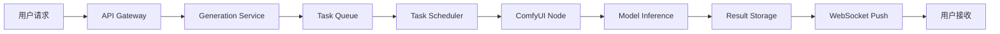

# Star-Graph AI生成平台系统架构详解

## 目录

1. [系统概述](#1-系统概述)
2. [整体架构设计](#2-整体架构设计)
3. [技术栈详解](#3-技术栈详解)
4. [核心模块设计](#4-核心模块设计)
5. [数据流架构](#5-数据流架构)
6. [通信架构](#6-通信架构)
7. [服务架构](#7-服务架构)
8. [安全架构](#8-安全架构)
9. [性能架构](#9-性能架构)
10. [部署架构](#10-部署架构)

## 1. 系统概述

### 1.1 平台定位

Star-Graph是一个企业级AI内容生成平台，专注于提供高质量的图像和视频生成服务。平台采用先进的深度学习模型，结合分布式架构设计，实现高并发、高可用的AI生成服务。

### 1.2 核心能力

```yaml
图像生成能力:
  - 文生图 (Text-to-Image)
  - 图生图 (Image-to-Image)  
  - 画质提升 (Upscale)
  - 姿势控制 (Pose Control)

视频生成能力:
  - 文生视频 (Text-to-Video)
  - 图生视频 (Image-to-Video)

系统能力:
  - 实时进度推送
  - 任务队列管理
  - 用户积分系统
  - 分布式计算
```

### 1.3 系统特点

- **高性能**: 分布式架构，支持横向扩展
- **高可用**: 服务冗余，故障自动转移
- **实时性**: WebSocket双向通信，毫秒级推送
- **可扩展**: 模块化设计，易于添加新功能
- **安全性**: 多层安全防护，数据加密传输

## 2. 整体架构设计

### 2.1 系统分层架构

```
┌─────────────────────────────────────────────────────────────┐
│                        接入层 (Access Layer)                 │
│                    Nginx / Load Balancer                     │
├─────────────────────────────────────────────────────────────┤
│                      应用层 (Application Layer)              │
│   ┌──────────────┐  ┌──────────────┐  ┌──────────────┐    │
│   │   Web UI     │  │   Admin UI   │  │   Mobile     │    │
│   │  (Vue 3)     │  │  (Vue 3)     │  │   (H5)       │    │
│   └──────────────┘  └──────────────┘  └──────────────┘    │
├─────────────────────────────────────────────────────────────┤
│                      服务层 (Service Layer)                  │
│   ┌──────────────────────────────────────────────────┐     │
│   │             Spring Boot Application              │     │
│   │  ┌────────┐ ┌────────┐ ┌────────┐ ┌────────┐  │     │
│   │  │  API   │ │WebSocket│ │  Task  │ │  Auth  │  │     │
│   │  │Gateway │ │ Server  │ │Scheduler│ │Service │  │     │
│   │  └────────┘ └────────┘ └────────┘ └────────┘  │     │
│   └──────────────────────────────────────────────────┘     │
├─────────────────────────────────────────────────────────────┤
│                    中间件层 (Middleware Layer)               │
│   ┌──────────┐  ┌──────────┐  ┌──────────┐  ┌──────────┐ │
│   │  Redis   │  │  RabbitMQ│  │  MySQL   │  │  MinIO   │ │
│   │  Cache   │  │  Queue   │  │  Database│  │  Storage │ │
│   └──────────┘  └──────────┘  └──────────┘  └──────────┘ │
├─────────────────────────────────────────────────────────────┤
│                      AI层 (AI Layer)                         │
│   ┌──────────────────────────────────────────────────┐     │
│   │                  ComfyUI Cluster                  │     │
│   │  ┌────────┐  ┌────────┐  ┌────────┐  ┌────────┐ │     │
│   │  │ Node 1 │  │ Node 2 │  │ Node 3 │  │ Node N │ │     │
│   │  │  GPU   │  │  GPU   │  │  GPU   │  │  GPU   │ │     │
│   │  └────────┘  └────────┘  └────────┘  └────────┘ │     │
│   └──────────────────────────────────────────────────┘     │
└─────────────────────────────────────────────────────────────┘
```

### 2.2 微服务架构设计

```yaml
服务划分:
  核心服务:
    - user-service: 用户管理服务
    - auth-service: 认证授权服务
    - generation-service: AI生成服务
    - payment-service: 支付积分服务
    - notification-service: 通知推送服务
    
  支撑服务:
    - config-service: 配置中心
    - registry-service: 服务注册
    - gateway-service: API网关
    - monitor-service: 监控服务
```

## 3. 技术栈详解

### 3.1 后端技术栈

```java
// 核心框架
@SpringBootApplication
public class StarGraphApplication {
    // Spring Boot 3.2.8
    // Spring Framework 6.x
    // Spring WebSocket
    // Spring Data Redis
}

// 技术组件
技术选型 {
    语言: Java 17
    框架: Spring Boot 3.2.8
    ORM: MyBatis-Plus 3.5.7
    缓存: Redis 7.x
    消息队列: RabbitMQ / Redis List
    数据库: MySQL 8.0
    WebSocket: STOMP over WebSocket
    模板引擎: Freemarker
    工具库: Hutool, Fastjson2, Lombok
}
```

### 3.2 前端技术栈

```javascript
// 技术架构
const techStack = {
  framework: 'Vue 3.4.x',
  language: 'TypeScript 5.x',
  buildTool: 'Vite 5.x',
  ui: 'Element Plus',
  state: 'Pinia',
  router: 'Vue Router 4',
  http: 'Axios',
  websocket: '@stomp/stompjs',
  style: 'SCSS',
  icons: 'SVG Icons'
}

// 项目结构
src/
├── api/          // API接口定义
├── components/   // 公共组件
├── composables/  // 组合式函数
├── router/       // 路由配置
├── store/        // 状态管理
├── utils/        // 工具函数
├── views/        // 页面视图
└── App.vue       // 根组件
```

### 3.3 AI技术栈

```python
# ComfyUI节点系统
AI_MODELS = {
    "text2img": {
        "base": "stable-diffusion-xl-base-1.0",
        "refiner": "stable-diffusion-xl-refiner-1.0",
        "vae": "sdxl-vae-fp16-fix"
    },
    "img2img": {
        "model": "stable-diffusion-v1-5",
        "controlnet": ["openpose", "canny", "depth"]
    },
    "video": {
        "text2video": "stable-video-diffusion",
        "img2video": "stable-video-diffusion-img2vid"
    },
    "upscale": {
        "models": ["RealESRGAN", "ESRGAN", "SwinIR"]
    }
}
```

## 4. 核心模块设计

### 4.1 用户认证模块

```java
@Component
public class AuthenticationModule {
    
    // JWT Token认证
    public class JwtTokenProvider {
        private static final String SECRET_KEY = "...";
        private static final long EXPIRATION_TIME = 86400000; // 24h
        
        public String generateToken(User user) {
            return JWT.create()
                .withSubject(user.getId().toString())
                .withClaim("username", user.getUsername())
                .withClaim("role", user.getRole())
                .withExpiresAt(new Date(System.currentTimeMillis() + EXPIRATION_TIME))
                .sign(Algorithm.HMAC512(SECRET_KEY));
        }
    }
    
    // Session管理
    @Service
    public class SessionManager {
        @Autowired
        private RedisTemplate<String, Object> redisTemplate;
        
        public void createSession(String userId, String sessionId) {
            String key = "session:" + sessionId;
            redisTemplate.opsForValue().set(key, userId, 24, TimeUnit.HOURS);
        }
    }
}
```

### 4.2 任务调度模块

```java
@Component
public class TaskSchedulerModule {
    
    @Scheduled(fixedDelay = 1000)
    public void processTaskQueue() {
        // 从Redis队列获取任务
        ComfyuiTask task = redisService.getNextTask();
        
        if (task != null) {
            // 检查ComfyUI节点可用性
            String availableNode = findAvailableNode();
            
            if (availableNode != null) {
                // 分发任务到可用节点
                dispatchTask(task, availableNode);
                
                // 更新任务状态
                updateTaskStatus(task.getId(), TaskStatus.PROCESSING);
            }
        }
    }
    
    private String findAvailableNode() {
        List<ComfyUINode> nodes = comfyUIService.getHealthyNodes();
        return nodes.stream()
            .filter(node -> node.getCurrentLoad() < node.getMaxLoad())
            .min(Comparator.comparing(ComfyUINode::getCurrentLoad))
            .map(ComfyUINode::getUrl)
            .orElse(null);
    }
}
```

### 4.3 WebSocket通信模块

```java
@Configuration
@EnableWebSocketMessageBroker
public class WebSocketModule extends WebSocketMessageBrokerConfigurer {
    
    @Override
    public void configureMessageBroker(MessageBrokerRegistry config) {
        // 启用简单代理
        config.enableSimpleBroker("/topic", "/queue");
        config.setApplicationDestinationPrefixes("/app");
        config.setUserDestinationPrefix("/user");
    }
    
    @Component
    public class WebSocketHandler {
        
        @MessageMapping("/generate")
        @SendToUser("/topic/result")
        public void handleGeneration(GenerationRequest request, Principal principal) {
            // 处理生成请求
            String userId = principal.getName();
            
            // 创建任务
            Task task = taskService.createTask(userId, request);
            
            // 发送初始响应
            messagingTemplate.convertAndSendToUser(
                userId,
                "/topic/status",
                new StatusMessage("Task created", task.getId())
            );
            
            // 异步处理任务
            CompletableFuture.runAsync(() -> {
                processTask(task, userId);
            });
        }
    }
}
```

### 4.4 AI生成模块

```java
@Service
public class AIGenerationModule {
    
    // 工作流模板管理
    @Component
    public class WorkflowTemplateManager {
        
        public String buildWorkflow(GenerationType type, Map<String, Object> params) {
            switch(type) {
                case TEXT_TO_IMAGE:
                    return buildText2ImageWorkflow(params);
                case IMAGE_TO_IMAGE:
                    return buildImage2ImageWorkflow(params);
                case TEXT_TO_VIDEO:
                    return buildText2VideoWorkflow(params);
                case IMAGE_TO_VIDEO:
                    return buildImage2VideoWorkflow(params);
                default:
                    throw new UnsupportedOperationException();
            }
        }
        
        private String buildText2ImageWorkflow(Map<String, Object> params) {
            // 构建ComfyUI节点图
            JSONObject workflow = new JSONObject();
            
            // CLIP文本编码节点
            workflow.put("3", createCLIPTextEncodeNode(params.get("prompt")));
            
            // KSampler采样节点  
            workflow.put("4", createKSamplerNode(params));
            
            // VAE解码节点
            workflow.put("5", createVAEDecodeNode());
            
            // 图像保存节点
            workflow.put("6", createSaveImageNode());
            
            return workflow.toJSONString();
        }
    }
}
```

## 5. 数据流架构

### 5.1 请求处理流程

```
用户请求 → API网关 → 身份认证 → 业务处理 → 响应返回

详细流程:
1. 用户发起HTTP请求
2. Nginx负载均衡转发
3. Spring Security认证
4. Controller接收请求
5. Service业务处理
6. 数据持久化
7. 响应结果返回
```

### 5.2 AI生成数据流



### 5.3 实时通信数据流

```java
// WebSocket消息流
public class MessageFlow {
    
    // 客户端 → 服务端
    @MessageMapping("/app/generate")
    public void handleClientMessage(Message message) {
        // 1. 接收客户端消息
        validateMessage(message);
        
        // 2. 处理业务逻辑
        ProcessResult result = processMessage(message);
        
        // 3. 广播或单播结果
        if (result.isBroadcast()) {
            messagingTemplate.convertAndSend("/topic/updates", result);
        } else {
            messagingTemplate.convertAndSendToUser(
                message.getUserId(),
                "/queue/personal", 
                result
            );
        }
    }
    
    // 服务端 → 客户端
    public void pushProgress(String userId, Progress progress) {
        messagingTemplate.convertAndSendToUser(
            userId,
            "/topic/progress",
            progress
        );
    }
}
```

## 6. 通信架构

### 6.1 双WebSocket架构

```yaml
WebSocket连接架构:
  前端-后端通信:
    协议: STOMP over WebSocket
    端点: ws://localhost:8080/ws
    心跳: 10s/10s
    重连: 自动重连，延迟5s
    
  后端-ComfyUI通信:
    协议: 原生WebSocket
    端点: ws://comfyui:8188/ws
    消息格式: JSON
    连接池: 最大10个连接
```

### 6.2 消息协议设计

```javascript
// STOMP消息格式
const messageProtocol = {
    // 订阅主题
    topics: {
        public: '/topic/public',      // 公共消息
        private: '/user/queue/reply',  // 私有消息
        progress: '/user/topic/progress', // 进度更新
        result: '/user/topic/result'    // 结果推送
    },
    
    // 消息类型
    messageTypes: {
        TASK_CREATED: 'task_created',
        TASK_QUEUED: 'task_queued',
        TASK_STARTED: 'task_started',
        PROGRESS_UPDATE: 'progress_update',
        TASK_COMPLETED: 'task_completed',
        TASK_FAILED: 'task_failed'
    },
    
    // 消息结构
    messageStructure: {
        type: 'string',
        taskId: 'string',
        userId: 'string',
        timestamp: 'number',
        data: 'object'
    }
}
```

### 6.3 API接口设计

```yaml
RESTful API设计:
  基础路径: /api/v1
  
  认证接口:
    POST   /auth/login     # 用户登录
    POST   /auth/logout    # 用户登出
    POST   /auth/refresh   # 刷新Token
    
  生成接口:
    POST   /generate/text2img    # 文生图
    POST   /generate/img2img     # 图生图
    POST   /generate/text2video  # 文生视频
    POST   /generate/img2video   # 图生视频
    POST   /generate/upscale     # 画质提升
    POST   /generate/pose        # 姿势控制
    
  任务接口:
    GET    /tasks              # 任务列表
    GET    /tasks/{id}         # 任务详情
    DELETE /tasks/{id}         # 取消任务
    
  用户接口:
    GET    /users/profile      # 用户信息
    GET    /users/balance      # 积分余额
    GET    /users/history      # 历史记录
```

## 7. 服务架构

### 7.1 服务分层设计

```java
// Controller层
@RestController
@RequestMapping("/api/v1/generate")
public class GenerationController {
    @Autowired
    private GenerationService generationService;
    
    @PostMapping("/text2img")
    public ResponseEntity<GenerationResponse> text2img(@RequestBody Text2ImgRequest request) {
        // 参数验证
        validateRequest(request);
        
        // 调用服务层
        GenerationResponse response = generationService.generateImage(request);
        
        // 返回结果
        return ResponseEntity.ok(response);
    }
}

// Service层
@Service
@Transactional
public class GenerationService {
    @Autowired
    private TaskRepository taskRepository;
    @Autowired
    private RedisService redisService;
    @Autowired
    private ComfyUIService comfyUIService;
    
    public GenerationResponse generateImage(Text2ImgRequest request) {
        // 创建任务
        Task task = createTask(request);
        
        // 保存到数据库
        taskRepository.save(task);
        
        // 加入队列
        redisService.addToQueue(task);
        
        // 触发异步处理
        processAsync(task);
        
        return new GenerationResponse(task.getId());
    }
}

// Repository层
@Mapper
public interface TaskRepository {
    @Insert("INSERT INTO tasks (id, user_id, type, status, params) VALUES (#{id}, #{userId}, #{type}, #{status}, #{params})")
    void save(Task task);
    
    @Select("SELECT * FROM tasks WHERE id = #{id}")
    Task findById(String id);
    
    @Update("UPDATE tasks SET status = #{status} WHERE id = #{id}")
    void updateStatus(String id, String status);
}
```

### 7.2 服务治理

```yaml
服务治理策略:
  服务发现:
    注册中心: Nacos / Eureka
    健康检查: 每30秒一次
    
  负载均衡:
    策略: Round Robin / Weighted
    失败重试: 3次
    
  熔断降级:
    框架: Hystrix / Sentinel
    熔断阈值: 错误率>50%
    降级策略: 返回缓存结果
    
  限流控制:
    全局限流: 10000 QPS
    用户限流: 100 QPS
    IP限流: 50 QPS
```

## 8. 安全架构

### 8.1 安全防护体系

```java
@Configuration
@EnableWebSecurity
public class SecurityConfiguration {
    
    // 认证授权
    @Bean
    public SecurityFilterChain filterChain(HttpSecurity http) throws Exception {
        http
            .authorizeHttpRequests(authz -> authz
                .requestMatchers("/api/public/**").permitAll()
                .requestMatchers("/api/admin/**").hasRole("ADMIN")
                .anyRequest().authenticated()
            )
            .addFilterBefore(jwtAuthenticationFilter(), UsernamePasswordAuthenticationFilter.class)
            .sessionManagement(session -> session.sessionCreationPolicy(SessionCreationPolicy.STATELESS))
            .csrf(csrf -> csrf.disable())
            .cors(cors -> cors.configurationSource(corsConfigurationSource()));
            
        return http.build();
    }
    
    // XSS防护
    @Component
    public class XSSFilter implements Filter {
        @Override
        public void doFilter(ServletRequest request, ServletResponse response, FilterChain chain) {
            XSSRequestWrapper wrappedRequest = new XSSRequestWrapper((HttpServletRequest) request);
            chain.doFilter(wrappedRequest, response);
        }
    }
    
    // SQL注入防护
    @Component
    public class SQLInjectionValidator {
        private static final Pattern SQL_PATTERN = Pattern.compile(
            ".*(;|--|'|\"|\\*|\\b(ALTER|CREATE|DELETE|DROP|EXEC|INSERT|SELECT|UPDATE)\\b).*",
            Pattern.CASE_INSENSITIVE
        );
        
        public boolean isSafe(String input) {
            return !SQL_PATTERN.matcher(input).matches();
        }
    }
}
```

### 8.2 数据安全

```yaml
数据安全策略:
  传输安全:
    - HTTPS/TLS 1.3
    - WebSocket over WSS
    - 数据签名验证
    
  存储安全:
    - 敏感数据加密
    - 密钥定期轮换
    - 备份数据加密
    
  访问控制:
    - RBAC权限模型
    - API密钥管理
    - IP白名单
```

## 9. 性能架构

### 9.1 性能优化策略

```java
@Component
public class PerformanceOptimization {
    
    // 缓存优化
    @Cacheable(value = "models", key = "#modelName")
    public Model loadModel(String modelName) {
        // 模型缓存，避免重复加载
        return modelLoader.load(modelName);
    }
    
    // 数据库优化
    @Configuration
    public class DatabaseConfig {
        @Bean
        public HikariDataSource dataSource() {
            HikariConfig config = new HikariConfig();
            config.setMaximumPoolSize(20);
            config.setMinimumIdle(5);
            config.setConnectionTimeout(30000);
            config.setIdleTimeout(600000);
            config.setMaxLifetime(1800000);
            return new HikariDataSource(config);
        }
    }
    
    // 异步处理
    @Configuration
    @EnableAsync
    public class AsyncConfig {
        @Bean
        public TaskExecutor taskExecutor() {
            ThreadPoolTaskExecutor executor = new ThreadPoolTaskExecutor();
            executor.setCorePoolSize(10);
            executor.setMaxPoolSize(50);
            executor.setQueueCapacity(100);
            executor.setThreadNamePrefix("Async-");
            executor.initialize();
            return executor;
        }
    }
}
```

### 9.2 性能监控

```yaml
监控指标:
  系统指标:
    - CPU使用率
    - 内存使用率
    - 磁盘I/O
    - 网络带宽
    
  应用指标:
    - QPS/TPS
    - 响应时间
    - 错误率
    - JVM指标
    
  业务指标:
    - 生成任务数
    - 成功率
    - 平均生成时间
    - 队列长度
    
监控工具:
  - Prometheus + Grafana
  - ELK Stack
  - SkyWalking
  - Spring Boot Actuator
```

## 10. 部署架构

### 10.1 容器化部署

```yaml
# docker-compose.yml
version: '3.8'

services:
  # 应用服务
  app:
    build: ./star-graph
    ports:
      - "8080:8080"
    environment:
      - SPRING_PROFILES_ACTIVE=prod
      - DB_HOST=mysql
      - REDIS_HOST=redis
    depends_on:
      - mysql
      - redis
    networks:
      - star-network
    deploy:
      replicas: 3
      resources:
        limits:
          cpus: '2'
          memory: 4G
          
  # 数据库服务
  mysql:
    image: mysql:8.0
    environment:
      - MYSQL_ROOT_PASSWORD=root123456
      - MYSQL_DATABASE=star_graph
    volumes:
      - mysql_data:/var/lib/mysql
    networks:
      - star-network
      
  # 缓存服务
  redis:
    image: redis:7-alpine
    command: redis-server --appendonly yes
    volumes:
      - redis_data:/data
    networks:
      - star-network
      
  # ComfyUI服务
  comfyui:
    build: ./comfyui
    ports:
      - "8188:8188"
    volumes:
      - ./models:/app/models
      - ./output:/app/output
    deploy:
      replicas: 4
      resources:
        reservations:
          devices:
            - driver: nvidia
              count: 1
              capabilities: [gpu]
    networks:
      - star-network

volumes:
  mysql_data:
  redis_data:
  
networks:
  star-network:
    driver: bridge
```

### 10.2 Kubernetes部署

```yaml
# deployment.yaml
apiVersion: apps/v1
kind: Deployment
metadata:
  name: star-graph-app
  namespace: star-graph
spec:
  replicas: 3
  selector:
    matchLabels:
      app: star-graph
  template:
    metadata:
      labels:
        app: star-graph
    spec:
      containers:
      - name: app
        image: star-graph:latest
        ports:
        - containerPort: 8080
        env:
        - name: SPRING_PROFILES_ACTIVE
          value: "k8s"
        resources:
          requests:
            memory: "2Gi"
            cpu: "1"
          limits:
            memory: "4Gi"
            cpu: "2"
        livenessProbe:
          httpGet:
            path: /actuator/health
            port: 8080
          initialDelaySeconds: 60
          periodSeconds: 10
        readinessProbe:
          httpGet:
            path: /actuator/ready
            port: 8080
          initialDelaySeconds: 30
          periodSeconds: 5
---
apiVersion: v1
kind: Service
metadata:
  name: star-graph-service
  namespace: star-graph
spec:
  selector:
    app: star-graph
  ports:
    - protocol: TCP
      port: 80
      targetPort: 8080
  type: LoadBalancer
---
apiVersion: autoscaling/v2
kind: HorizontalPodAutoscaler
metadata:
  name: star-graph-hpa
  namespace: star-graph
spec:
  scaleTargetRef:
    apiVersion: apps/v1
    kind: Deployment
    name: star-graph-app
  minReplicas: 3
  maxReplicas: 10
  metrics:
  - type: Resource
    resource:
      name: cpu
      target:
        type: Utilization
        averageUtilization: 70
  - type: Resource
    resource:
      name: memory
      target:
        type: Utilization
        averageUtilization: 80
```

### 10.3 CI/CD流程

```yaml
# .gitlab-ci.yml
stages:
  - build
  - test
  - deploy

variables:
  DOCKER_REGISTRY: registry.example.com
  APP_NAME: star-graph

# 构建阶段
build:
  stage: build
  script:
    - mvn clean package
    - docker build -t $DOCKER_REGISTRY/$APP_NAME:$CI_COMMIT_SHA .
    - docker push $DOCKER_REGISTRY/$APP_NAME:$CI_COMMIT_SHA
  only:
    - master
    - develop

# 测试阶段
test:
  stage: test
  script:
    - mvn test
    - npm run test:unit
    - npm run test:e2e
  coverage: '/Total coverage: \d+\.\d+%/'

# 部署阶段
deploy:
  stage: deploy
  script:
    - kubectl set image deployment/$APP_NAME $APP_NAME=$DOCKER_REGISTRY/$APP_NAME:$CI_COMMIT_SHA
    - kubectl rollout status deployment/$APP_NAME
  environment:
    name: production
    url: https://star-graph.example.com
  only:
    - master
```

## 总结

Star-Graph AI生成平台采用了现代化的微服务架构设计，通过分层架构、模块化设计、容器化部署等技术手段，实现了一个高性能、高可用、易扩展的企业级AI内容生成系统。

### 架构亮点

1. **双WebSocket架构**: 实现前后端实时通信和AI服务对接
2. **分布式任务调度**: 支持大规模并发生成任务
3. **智能负载均衡**: 动态分配GPU资源，优化计算效率
4. **多级缓存策略**: 提升系统响应速度
5. **完善的安全体系**: 多层防护确保系统安全
6. **容器化部署**: 支持快速扩容和自动化运维

### 技术创新

1. **模板化工作流**: 灵活配置AI生成流程
2. **实时进度推送**: 毫秒级状态更新
3. **智能积分系统**: 精确计费和资源管理
4. **自适应队列**: 动态调整处理优先级
5. **故障自愈机制**: 自动检测和恢复服务

本架构设计充分考虑了系统的可扩展性、可维护性和高可用性，为AI内容生成服务提供了坚实的技术基础。